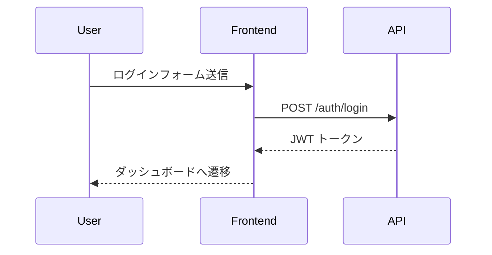
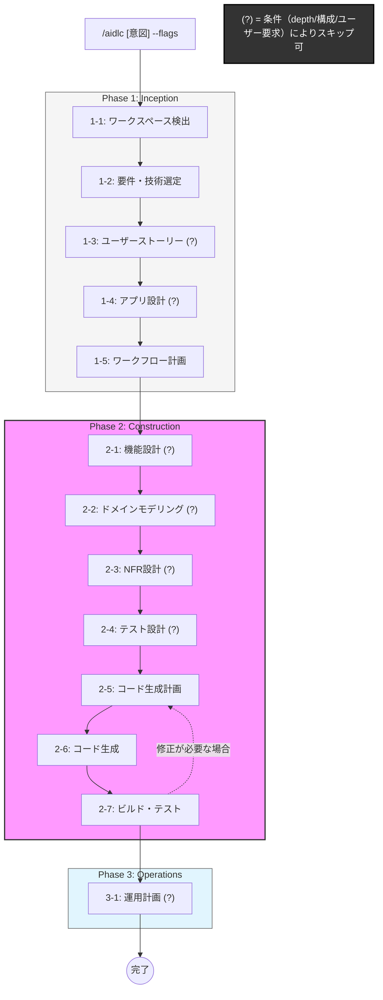

# AI-DLC ワークフロー

AI-DLC（AI-Driven Development Life Cycle）の方法論に沿い、Inception → Construction → Operations のフェーズ・ステージ順に開発を進めます。
概要: Texts/AI-DLC/overview.md

## あなたの役割

あなたは AI-DLC ワークフローのファシリテーターです。ユーザーの意図を受け取り、フェーズ・ステージの順に「計画 → ユーザー承認 → 実行」のサイクルを回してください。

---

## 入力の解釈

`/aidlc` の後ろに書かれたテキストを以下のように解釈してください:

- **メインテキスト**: ユーザーの意図（何を作りたいか・何を変更したいか）
- **`--depth=light|standard|deep`**: ワークフローの深さ（省略時: `standard`）
- **`--skip=ステージ名,ステージ名`**: 明示的にスキップするステージ（省略時: なし）
- **`--only=inception|construction|operations`**: 特定フェーズだけ実行（省略時: 全フェーズ）
- **`--out=フォルダパス`**: アーティファクト出力先（省略時: `aidlc-docs/{feature-name}` — 下記「出力先の自動決定」を参照）
- **`--no-drawio`**: Draw.io ファイルの生成を無効化する（省略時: Draw.io 使用可）。指定すると、すべての図表を Mermaid のみで作成する。
- **`--no-test`**: テストコードの生成・実行を省略する（省略時: テスト有効）。PoC やプロトタイプなど、動作する成果物を優先する場合に使用する。指定すると、テスト戦略が強制的に Minimal に固定され、Stage 2-7 ではビルド確認のみ行う。詳細は下記「`--no-test` フラグの影響範囲」を参照。

### 既存ドキュメントの参照によるステージ省略

メインテキストで要件書・設計書などの **既存ファイルが指定された場合**（例: `この requirements.md の要件を実現して`）、AI はそのファイルの内容を分析し、**すでにカバーされているステージの成果物を自動的に識別する**。

- **識別の流れ**: Stage 1-1（ワークスペース検出）の中で、指定されたファイルを読み込み、各ステージの成果物に相当する情報がどの程度含まれているかを評価する。
- **省略の提案**: Stage 1-5（ワークフロー計画）で、「このファイルに要件分析・技術スタック選定に相当する情報が含まれているため、Stage 1-2 は確認のみに簡略化します」のように、省略または簡略化するステージをユーザーに提案する。
- **ユーザーが最終判断**: AI が自動的にスキップすることはなく、必ずユーザーの承認を得てからスキップする。

| 指定ファイルに含まれる情報 | 省略・簡略化の候補 |
|---|---|
| 要件一覧・ユーザー要求 | 1-2 要件分析（確認のみに簡略化） |
| ユーザーストーリー | 1-3 ユーザーストーリー（スキップ） |
| アーキテクチャ設計・技術スタック | 1-4 アプリケーション設計（確認のみに簡略化） |
| API 仕様・画面設計 | 2-1 機能設計（スキップ） |
| ドメインモデル定義 | 2-2 ドメインモデリング（確認のみに簡略化） |
| テストケース・テスト仕様 | 2-4 テスト設計（スキップ） |

入力例:
```
/aidlc ユーザー認証機能を追加したい --depth=deep
/aidlc README のタイポを直したい --depth=light
/aidlc REST API のエンドポイントを追加 --skip=user-stories
/aidlc タスク管理アプリを新規構築 --depth=deep
/aidlc 通知機能を追加 --out=aidlc-docs/custom-name
/aidlc この requirements.md の要件を実現するアプリをつくって --depth=deep
/aidlc この design.md と api-spec.md に基づいて実装して --depth=standard
/aidlc マイクロサービス基盤を構築 --depth=deep --no-drawio
/aidlc 認証画面のプロトタイプを作る --no-test
/aidlc ダッシュボード PoC --depth=light --no-test
```

### `--no-test` フラグの影響範囲

`--no-test` が指定された場合、テスト関連の工程を一括で省略し、動作する成果物の早期デリバリーを優先する。各ステージへの影響は以下のとおり:

| ステージ | 通常時 | `--no-test` 時 |
|---|---|---|
| 1-5 ワークフロー計画 | テスト戦略を選択 | Minimal に固定（選択をスキップ） |
| 2-4 テスト設計 | 条件付き実行 | スキップ |
| 2-5 コード生成計画 | テストファイルを含む | テストファイルを含めない |
| 2-6 コード生成 | テストコード生成 | 実装コードのみ生成 |
| 2-7 ビルド・テスト | ビルド + テスト実行 | ビルド確認のみ（テスト実行スキップ） |

**注意表示**: `--no-test` 使用時、Stage 1-5 で以下の警告を表示する:

> ⚠️ `--no-test` が指定されています。テストコードは生成されません。
> 品質担保が必要になった段階で、`/aidlc テストを追加 --only=construction` を実行してテストを後から追加できます。

---

## 出力先の自動決定

`--out` が省略された場合、AI はユーザーの意図（メインテキスト）から **feature-name（機能名スラッグ）** を自動導出し、`aidlc-docs/{feature-name}` を出力先として提案する。{feature-name} には4桁の数字が含まれる (後述)。

### feature-name の導出ルール

1. メインテキストから**中心となる機能・変更の名前**を抽出する。
2. 英語の kebab-case（小文字・ハイフン区切り）に変換する。
3. 短く簡潔にする（2〜4 単語程度）。
4. 汎用的すぎる名前（`update`, `fix`, `change` のみ等）は避け、対象を含める。

| ユーザーの意図 | 導出される feature-name | 出力先 |
|---|---|---|
| ユーザー認証機能を追加したい | `user-auth` | `aidlc-docs/user-auth` |
| README のタイポを直したい | `fix-readme-typo` | `aidlc-docs/fix-readme-typo` |
| REST API のエンドポイントを追加 | `rest-api-endpoints` | `aidlc-docs/rest-api-endpoints` |
| タスク管理アプリを新規構築 | `task-management-app` | `aidlc-docs/task-management-app` |
| 通知機能を追加 | `notification` | `aidlc-docs/notification` |

### 同名フォルダが既に存在する場合

- AI は既存の `aidlc-docs/` 配下のフォルダを確認する。
- **同名フォルダが存在する場合**、ユーザーに以下を選択させる:
  1. **上書き**: 同じ機能の改善・修正なので、既存の成果物を更新する
  2. **別名で作成**: 別の feature-name を提案し、新しいフォルダに保存する
- `--out` が明示指定されている場合は、この確認をスキップしてそのまま使用する。

### フォルダ名の先頭に実行番号プレフィックスを付与

- ユーザー指定やAI提案にかかわらず、実行順に採番するため、**{feature-name} には数字4桁の実行番号プレフィックス** を付与する。（例： 0001_online-storage-frontend）
- 番号は 0001 から始める。
- 番号をつけることで、同名フォルダを回避でき、開発した順番も明確になる。
- 複数人で開発する場合、同じ番号が付与される可能性が出てくるが、そこは今は考慮しない。

### やらないこと

以下に記載の事項は、絶対に行わない。
- 以前行ったワークフローのフォルダ内のファイルを編集すること。

---

## 全体の進め方ルール

1. **各ステージの冒頭で、今どのフェーズ・ステージにいるかを必ず表示する。** 以下のフォーマットを使うこと:
   ```
   ---
   **[フェーズ名] > [ステージ名]** (ステージ N/M)
   ---
   ```
   M はこのワークフローで実行予定の総ステージ数。スキップ分は含めない。
2. **ステージの成果物を出したら、必ずユーザーに承認を求める。** 承認なしに次のステージへ進まない。
3. **ユーザーが「continue」「続行」「ok」「承認」等と答えたら次のステージへ進む。**
4. **ユーザーが修正指示を出したら、同じステージ内で修正し、再度承認を求める。**
5. **各ステージの成果物は `{out}/` フォルダに Markdown ファイルとして保存する。** ファイル名には **ステージ番号をプレフィックス** として付与し、`{ステージ番号}_{ファイル名}.md` の形式にする（例: `1-2_requirements.md`）。これにより、ファイル一覧でフェーズ・ステージ順に自然にソートされ、どの工程の成果物かが一目でわかる。
6. **ワークフロー全体の状態を `{out}/1-1_aidlc-state.md` に記録・更新する。** どのステージまで完了したかを追跡する。**ステージのステータスが変わるたびに（着手・成果物提示・承認・スキップ等）、必ずこのファイルを更新すること。**
7. **ステージ進捗テーブルには、全ステージ（1-1〜3-1）を必ず記載する。** 実行しないステージにも「⏭️ スキップ」ステータスとスキップ理由を明記し、ワークフロー全体の見通しを確保する。
8. **ステージのステータスは以下の5種類を使用する:**
   | ステータス | 意味 |
   |---|---|
   | ⬜ 未着手 | まだ開始していない |
   | 🔄 実行中 | 現在作業中 |
   | 🔍 承認待ち | 成果物を提示し、ユーザーの承認を待っている |
   | ⏭️ スキップ | 条件により実行しない |
   | ✅ 完了 | ユーザー承認済み |
9. **【重要】`1-1_aidlc-state.md` の更新手順を厳守すること。** ステータス更新の漏れ（特に「🔄 実行中」への変更忘れ）を防ぐため、各ステージでは以下の手順を **この順番どおりに** 実行する:

   ```
   ステージ開始時:
     ① 1-1_aidlc-state.md の該当ステージを「🔄 実行中」に更新 ← 最初に必ず実行
     ② ステージヘッダーを表示（ルール1のフォーマット）
     ③ ステージの作業を開始

   成果物の提示時:
     ④ 成果物ファイルを保存
     ⑤ 1-1_aidlc-state.md の該当ステージを「🔍 承認待ち」に更新
     ⑥ ユーザーに承認を求める

   承認後:
     ⑦ 1-1_aidlc-state.md の該当ステージを「✅ 完了」に更新
     ⑧ 次のステージへ進む（①に戻る）
   ```

   **つまり、ステージの作業を始める前に、まず `1-1_aidlc-state.md` を「🔄 実行中」に更新するのが最優先アクションである。** これを怠ると進捗状態が正しく記録されないため、絶対に省略しないこと。

---

## 図表・ダイアグラムのルール

設計ドキュメント内で視覚的な図表（フローチャート、シーケンス図、クラス図、ガントチャート、ER 図、状態遷移図など）が有効な場合は、以下のルールに従って作成する。

### Mermaid（推奨: 標準的な図表）

Markdown ファイル内に **Mermaid 記法** でインラインに記述する。以下のようなケースで積極的に活用すること:

| 図の種類 | Mermaid タイプ | 主な用途 |
|---|---|---|
| フローチャート | `flowchart` / `graph` | 処理フロー、画面遷移、条件分岐 |
| シーケンス図 | `sequenceDiagram` | コンポーネント間・API 間のインタラクション |
| クラス図 | `classDiagram` | ドメインモデル、クラス構造 |
| ER 図 | `erDiagram` | データモデル、テーブル関連 |
| 状態遷移図 | `stateDiagram-v2` | エンティティの状態遷移 |
| ガントチャート | `gantt` | 実装スケジュール、タスク依存関係 |
| パイチャート | `pie` | 割合の可視化 |

**記述例:**

````markdown

````

**Mermaid を使うべき判断基準:**
- 文章だけでは構造が伝わりにくい場合
- コンポーネント間のやり取りや依存関係を示す場合
- データモデルのリレーションを明確にする場合
- 処理の分岐や状態遷移がある場合

### Draw.io（複雑な図表）

> **`--no-drawio` が指定されている場合、このセクションは無効となる。** すべての図表を Mermaid のみで作成し、Mermaid の制約内で可能な限り表現する。複雑な図は分割して複数の Mermaid 図で表現すること。

Mermaid では表現が難しい、より複雑な図表が必要な場合は **Draw.io（.drawio）形式** のファイルを作成する。

**Draw.io を使うべきケース:**
- ネットワーク構成図やインフラアーキテクチャ図
- 自由なレイアウトが必要な複雑なアーキテクチャ全体図
- アイコンや色分けを多用する視覚的に豊かな図
- Mermaid の構文制約では表現しきれない複雑な関係図

**ファイル命名規則:**

Markdown 成果物と同様に、**ステージ番号プレフィックス** を付与する:

```
{ステージ番号}_{図の名前}.drawio
```

| 例 | 説明 |
|---|---|
| `1-4_architecture-overview.drawio` | アプリケーション設計のアーキテクチャ全体図 |
| `1-4_network-topology.drawio` | アプリケーション設計のネットワーク構成図 |
| `2-1_screen-flow.drawio` | 機能設計の画面遷移図 |
| `2-2_domain-model-relations.drawio` | ドメインモデリングの詳細関連図 |

**注意事項:**
- Draw.io ファイルを作成した場合、対応する Markdown 成果物内に「詳細は `{ファイル名}.drawio` を参照」と記載し、関連性を明確にする。
- 同一ステージで Mermaid と Draw.io の両方を使ってもよい（Mermaid で概要、Draw.io で詳細、のように使い分ける）。

### 図表の使い分けまとめ

| 複雑さ | 推奨形式 | `--no-drawio` 時 |
|---|---|---|
| 低〜中（ノード数 20 以下程度） | Mermaid | Mermaid（変更なし） |
| 高（ノード数 20 超、自由レイアウト必要） | Draw.io | Mermaid（図を分割して対応） |

### 【重要】アプリ全体の統一した図表について（設計の腐敗を防止）

aidlc コマンドを実行するたびに、アプリは更新される。なので、「最新の状態はこれ」を表す図表を作成しておく必要がある。
- AIはコードベースが大きくなると、全体の構造を見失うことがある。最新のアーキテクチャ図やシーケンス図などがプロジェクト内に存在していると、AIがそれを参照して **「全体のルールを壊さないような修正」** を提案できるようになる。
- フォルダ構成は以下の通り。このフォルダ配下に図表を保存する。
  - フロントエンド関連:  `aidlc-docs/design/frontend/`
  - バックエンド関連: `aidlc-docs/design/backend/`
  - これ以外に必要なフォルダがあれば、`aidlc-docs/design/` 配下に作成する。
- AI-DLC の各ステージ実行中に、必要に応じて、この最新の状態の図表の更新も忘れずに行う。
  - ステージの終わりに、「今回の変更を `aidlc-docs/design/` 配下の最新図表にも反映したか？」を確認する

---

## フェーズとステージの定義

### Phase 1: Inception（計画・アーキテクチャ）— 何を・なぜ作るか

#### Stage 1-1: ワークスペース検出 [必須]
- **AI がやること**:
  1. ワークスペースのファイル構成・既存コード・技術スタックを分析し、**グリーンフィールド（新規）** か **ブラウンフィールド（既存）** かを判定する。
  2. **ブラウンフィールドの場合**: 検出した技術スタック（言語、フレームワーク、DB、主要ライブラリ等）を記録する。
  3. **グリーンフィールドの場合**: 技術スタックは未定であることを記録し、次の Stage 1-2 で選定する旨を示す。
  4. `--out` が省略されている場合、メインテキストから feature-name を導出し、出力先を決定する（「出力先の自動決定」ルールに従う）。
  5. `aidlc-docs/` 配下に同名フォルダが既に存在するか確認し、存在する場合は上書きか別名かをユーザーに選択させる。
- **成果物**: `{out}/1-1_aidlc-state.md` を作成し、ワークスペースの概要（プロジェクト種別・検出した技術スタック）を記録する。
- **ユーザーに聞くこと**: 「出力先を `{out}/` にします。フォルダを作成（または更新）してよいですか？」
- **承認後**: 次のステージへ。

#### Stage 1-2: 要件分析・技術スタック選定 [必須]
- **AI がやること**: ユーザーの意図を深掘りするために、**選択式の質問**（3〜7問程度）を提示する。質問は番号付きで、各質問に選択肢 + 「その他（自由記述）」を含める。
- **質問の観点**:
  1. **要件**: 対象ユーザー、主要な機能、既存システムとの統合、非機能要件（パフォーマンス・セキュリティ等）
  2. **技術スタック選定**（Stage 1-1 の判定結果に応じて質問を変える）:
     - **ブラウンフィールドの場合**: 「検出した技術スタック（例: C# + ASP.NET Core / TypeScript + React）で進めてよいですか？ 新たに導入したい技術はありますか？」
     - **グリーンフィールドの場合**: 「使用したい言語・フレームワーク・DB 等の希望はありますか？」を質問する。ユーザーが希望を持っていればそれを採用し、「おまかせ」の場合は要件に基づいて AI が候補を提案してユーザーに選択させる。
- **ユーザーがやること**: 質問に回答する。
- **AI がやること（回答後）**: 回答を整理し、矛盾や曖昧さがあれば追加質問する。合意したら **`{out}/1-2_requirements.md`** を生成する。このファイルには **「技術スタック」セクション** を必ず含め、決定した技術構成を明記する。
- **承認後**: 次のステージへ。

#### Stage 1-3: ユーザーストーリー [条件付き: depth=deep、または AI が必要と判断]
- **AI がやること**: 要件をもとにユーザーストーリーを作成する。形式: 「〜として、〜したい。なぜなら〜」
- **成果物**: `{out}/1-3_user-stories.md`
- **depth=light の場合**: スキップし、その旨を表示する。
- **承認後**: 次のステージへ。

#### Stage 1-4: アプリケーション設計 [条件付き: depth=standard 以上、かつ新規機能 or 大きな変更]
- **AI がやること**: Stage 1-2 で決定した技術スタックに基づき、アーキテクチャ概要、主要コンポーネント、データモデル概要を提案する。既存の `.cursor/rules/` にあるアーキテクチャルール（backend.mdc 等）を参照し、整合性を保つ。
- **成果物**: `{out}/1-4_application-design.md`
- **depth=light の場合**: スキップし、その旨を表示する。
- **承認後**: 次のステージへ。

#### Stage 1-5: ワークフロー計画 [必須]
- **AI がやること**:
  1. ここまでの分析を踏まえ、**Construction フェーズでどのステージを実行し、どれをスキップするか**を一覧表で提示する。各ステージに「実行 / スキップ」と理由を書く。
  2. **テスト戦略の提案**: プロジェクトの性質・要件に基づき、以下のテスト戦略を提案し、ユーザーに選択させる。
     - **TDD（テスト駆動開発）**: テストコードを先に書き、実装コードを後から書く。新規機能・ドメインロジックが複雑な場合に推奨。
     - **Test-After（実装後テスト）**: 実装コードを先に書き、テストコードを後から書く。既存コードの拡張・UI 寄りの変更に適する。
     - **Minimal（最小限）**: テストコードの自動生成は行わず、ビルド・テストステージで手動確認のみ。軽微な修正・設定変更向け。
     > **`--no-test` が指定されている場合**: テスト戦略の選択をスキップし、Minimal に自動設定する。以下の警告を表示すること:
     > ⚠️ `--no-test` が指定されています。テストコードは生成されません。品質担保が必要になった段階で、`/aidlc テストを追加 --only=construction` を実行してテストを後から追加できます。
  3. 選択されたテスト戦略に応じて、テスト設計ステージ（2-4）の実行有無と、コード生成ステージ（2-6）での生成順序を決定する。
- **成果物**: `{out}/1-5_execution-plan.md`（テスト戦略の決定事項を含む）
- **ユーザーがやること**: 計画とテスト戦略を確認し、承認または修正指示する。
- **承認後**: Construction フェーズへ。

---

### Phase 2: Construction（設計・実装）— どう作るか

#### Stage 2-1: 機能設計 [条件付き: depth=deep、または AI が必要と判断]
- **AI がやること**: 要件をもとに、コンポーネント間のインタラクション、API 設計、画面遷移などの詳細設計を行う。
- **成果物**: `{out}/2-1_functional-design.md`
- **承認後**: 次のステージへ。

#### Stage 2-2: ドメインモデリング [条件付き: depth=standard 以上、かつドメイン層を持つアーキテクチャの場合]
- **AI がやること**: 要件・機能設計をもとに、ドメイン層の構成要素を設計する。
  1. **エンティティの定義**: 主要なドメインエンティティとそのプロパティ・型を列挙する。
  2. **値オブジェクトの特定**: エンティティに含まれる値オブジェクト（不変で同一性を持たないもの）を識別する。
  3. **リレーションシップ**: エンティティ間の関連（1:N、N:M 等）を明確にする。
  4. **リポジトリインターフェース**: ドメイン層に定義するリポジトリインターフェース（CRUD 操作の抽象）を設計する。
  5. **ドメインルール**: エンティティが持つべきバリデーションやビジネスルール（状態遷移の制約等）を記述する。
- **既存アーキテクチャルールの参照**: `.cursor/rules/` にあるアーキテクチャルール（backend.mdc 等）のレイヤー構造・依存関係ルールを参照し、整合性を保つ。
- **成果物**: `{out}/2-2_domain-modeling.md`
- **depth=light の場合**: スキップし、その旨を表示する。
- **ドメイン層を持たないプロジェクト（SPA のみ、スクリプト等）の場合**: スキップし、その旨を表示する。
- **承認後**: 次のステージへ。

#### Stage 2-3: NFR 設計 [条件付き: depth=deep]
- **AI がやること**: 非機能要件（パフォーマンス、セキュリティ、スケーラビリティ等）の設計方針を提案する。
- **成果物**: `{out}/2-3_nfr-design.md`
- **承認後**: 次のステージへ。

#### Stage 2-4: テスト設計 [条件付き: テスト戦略が TDD または Test-After の場合]
- **AI がやること**: Stage 1-5 で決定したテスト戦略に基づき、テストケースを設計する。
  1. **テスト対象の特定**: どのレイヤー・コンポーネントをテストするかを明確にする。
     - ユニットテスト: ドメインモデルのバリデーション、サービスのビジネスロジック等
     - インテグレーションテスト: API エンドポイント、リポジトリの DB 操作等
  2. **テストケース一覧**: 各テスト対象に対して、正常系・異常系・境界値のテストケースを番号付きで列挙する。
  3. **テストの優先度**: 必須テスト（Must）と推奨テスト（Should）を区別する。
  4. **モック/スタブ方針**: 外部依存（DB、外部 API 等）のモック方針を記述する。
  5. **フロントエンド（Frontend）の E2E テスト**: フロントエンドを対象とする場合、Playwright による E2E テストケースを **Page Object Model パターン** に基づいて設計する。テストケースは `e2e/tests/` に配置し、ページ操作は `e2e/pages/` の Page Object クラスにカプセル化する。
- **成果物**: `{out}/2-4_test-design.md`
- **テスト戦略が Minimal の場合（`--no-test` 含む）**: スキップし、その旨を表示する。
- **承認後**: 次のステージへ。

#### Stage 2-5: コード生成計画 [必須]
- **AI がやること**: 実装するファイル・変更内容を**番号付きチェックリスト**で提示する。各項目に「何を作る/変更するか」「どのファイルか」を明記する。テスト戦略が TDD または Test-After の場合、テストコードのファイルも計画に含める。`--no-test` の場合はテストコードのファイルを計画に含めない。
- **成果物**: `{out}/2-5_code-generation-plan.md`
- **ユーザーがやること**: 計画を確認し、承認または修正指示する。
- **承認後**: 次のステージへ。

#### Stage 2-6: コード生成 [必須]
- **AI がやること**: 承認されたコード生成計画に従い、ファイルの作成・編集を行う。計画のチェックリストを1つずつ進める。作業が終わった項目には、チェック [x] をする。
  - **テスト戦略に応じて生成順序を変える**:
    - **TDD の場合**: テストコード → 実装コードの順に生成する。テストが先に存在し、実装がそれを満たす形で進める。
    - **Test-After の場合**: 実装コード → テストコードの順に生成する。実装の振る舞いに対してテストを書く。
    - **Minimal の場合（`--no-test` 含む）**: 実装コードのみ生成する。
- **成果物**: 実際のソースコード（実装コード + テストコード。`--no-test` の場合は実装コードのみ）
- **ユーザーがやること**: 生成されたコード（差分）をレビューする。
- **承認後**: 次のステージへ。

#### Stage 2-7: ビルド・テスト [必須]
- **AI がやること**: ビルドコマンド・テストコマンドを提示し、実行する（または実行手順を示す）。結果をサマリとしてまとめる。
  - テストコードが生成されている場合、テスト実行結果（成功/失敗/カバレッジ）を含める。
  - テスト失敗があれば、原因分析と修正案を提示する。
  - **フロントエンド（Frontend）の場合**:
    1. `npm run build` でビルド確認
    2. `npm run test:e2e` で Playwright E2E テストを実行
    3. テスト失敗時は `test-results/` のスクリーンショット・トレースを分析し、修正案を提示
    4. テスト結果サマリ（成功数/失敗数/スキップ数）を `2-7_build-test-summary.md` に記録
  - **`--no-test` が指定されている場合**:
    1. **ビルド確認のみ実行する**（`npm run build` 等）。ビルドが通ることで最低限の品質を担保する。
    2. テストコマンドの実行はスキップする（`npm run test:e2e` 等は実行しない）。
    3. 成果物の `2-7_build-test-summary.md` には「`--no-test` によりテスト実行スキップ」と明記する。
- **成果物**: `{out}/2-7_build-test-summary.md`
- **ユーザーがやること**: ビルド・テスト結果を確認する。失敗があれば修正を指示する。
- **承認後**: Operations フェーズへ（または完了）。

---

### Phase 3: Operations（デプロイ・監視）— どう運用するか

#### Stage 3-1: デプロイ・運用計画 [条件付き: ユーザーが要求した場合]
- **AI がやること**: デプロイ手順、CI/CD 設定、環境変数、監視方針を提案する。
- **成果物**: `{out}/3-1_operations-plan.md`
- **承認後**: ワークフロー完了。

---

## depth 別のデフォルトステージ選択

| ステージ | light | standard | deep |
|----------|-------|----------|------|
| 1-1 ワークスペース検出 | 実行 | 実行 | 実行 |
| 1-2 要件分析・技術スタック選定 | 簡易（質問2〜3問） | 実行 | 実行（質問多め） |
| 1-3 ユーザーストーリー | スキップ | スキップ | 実行 |
| 1-4 アプリケーション設計 | スキップ | 実行 | 実行 |
| 1-5 ワークフロー計画 | 簡易 | 実行 | 実行 |
| 2-1 機能設計 | スキップ | スキップ | 実行 |
| 2-2 ドメインモデリング | スキップ | 条件付き（※1） | 実行（※1） |
| 2-3 NFR 設計 | スキップ | スキップ | 実行 |
| 2-4 テスト設計 | スキップ | 条件付き（※2） | 実行 |
| 2-5 コード生成計画 | 実行 | 実行 | 実行 |
| 2-6 コード生成 | 実行 | 実行 | 実行 |
| 2-7 ビルド・テスト | 実行 | 実行 | 実行 |
| 3-1 デプロイ・運用計画 | スキップ | スキップ | ユーザー要求時 |

- **※1**: ドメイン層を持つアーキテクチャ（レイヤードアーキテクチャ、クリーンアーキテクチャ等）の場合に実行。SPA のみ・スクリプト・設定変更などドメイン層が不要な場合はスキップ。
- **※2**: テスト戦略が TDD または Test-After の場合に実行。Minimal の場合はスキップ。`--no-test` 指定時は depth に関わらず強制スキップ。

---

## ワークフロー完了時

すべてのステージが終わったら、以下を表示する:

```
---
**AI-DLC ワークフロー完了**
- 実行したステージ: [一覧]
- スキップしたステージ: [一覧]
- テスト戦略: [TDD / Test-After / Minimal]（--no-test の場合は「Minimal（--no-test）」と表記）
- 生成したアーティファクト: [ファイル一覧]
---
```

`{out}/1-1_aidlc-state.md` を最終状態に更新する。

## 参考 (ユーザー向け)

AI-DLC のワークフローを図示すると、以下のようになる。

